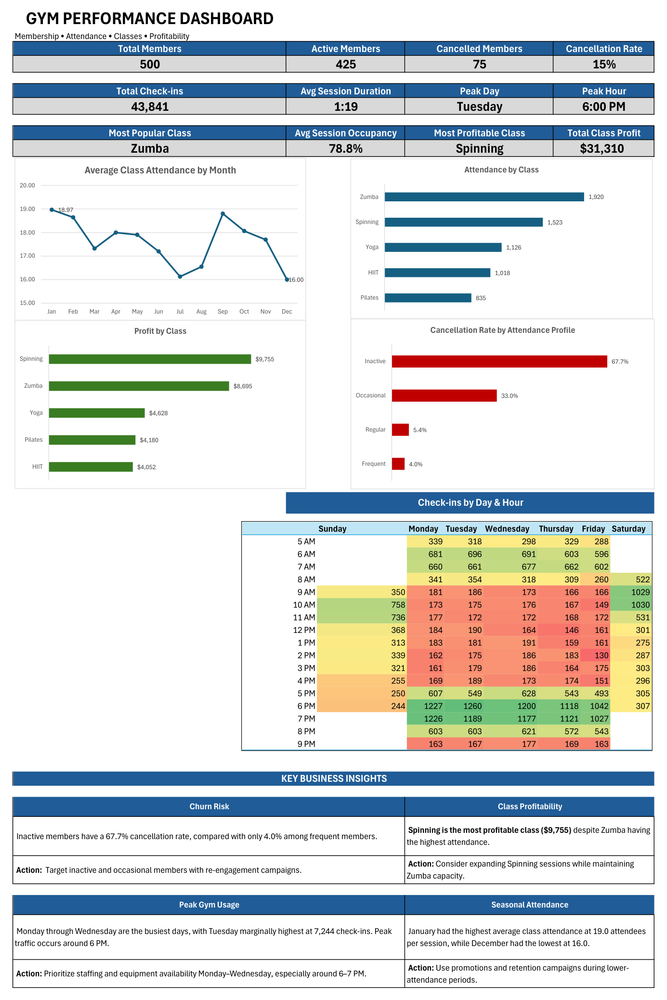

# Gym Analytics Project

End-to-end data analytics project analyzing gym membership, attendance, class performance, profitability, and cancellation risk.

**Tools:** Microsoft Excel | SQL | Power BI

> **Project Status:** Excel analysis completed. SQL and Power BI phases coming next.

## Excel Dashboard



## Project Overview

This project analyzes a synthetic gym operations dataset to identify patterns in member behavior, gym attendance, class performance, profitability, cancellation risk, and seasonal trends.

The dataset includes **500 gym members**, **43,841 check-ins**, **365 group class sessions**, and daily weather observations for **2025**.

The goal of the project is to transform raw operational data into meaningful business insights and actionable recommendations.

## Business Questions

The analysis focuses on five key business questions:

1. When are the busiest days and hours at the gym?
2. Which members show the highest cancellation risk?
3. Which group classes are the most popular and profitable?
4. How long does the average gym session last?
5. Do seasonal patterns or weather conditions appear to affect attendance?

6. ## Dataset Structure

The project is built around four main datasets:

| Dataset | Description |
|---|---|
| **users** | Member information including demographics, membership type, membership status, attendance profile, and age group. |
| **gym_checkins** | Individual gym visits including check-in and check-out times, session duration, day of week, and hour of day. |
| **group_classes** | Group class sessions including class type, capacity, attendance, revenue, profit, occupancy rate, and weather conditions. |
| **weather** | Daily weather observations including temperature, weather condition, and rainfall. |

## Excel Skills & Techniques

The Excel phase of the project includes:

- Excel Tables and Structured References
- Data Cleaning and Validation
- XLOOKUP
- COUNTIF, SUM, AVERAGE, IF, DATEDIF, TEXT, HOUR, and TIME
- PivotTables and PivotCharts
- Conditional Formatting
- KPI Development
- Date and Time Analysis
- Basic Statistical Analysis (Correlation)
- Data Visualization
- Interactive Dashboard Design
- Business Insight Development

## Key Findings

- **Peak Gym Usage:** Monday through Wednesday are the busiest days, with Tuesday marginally highest at **7,244 check-ins**. Peak traffic occurs around **6:00 PM**.
- **Cancellation Risk:** Inactive members have a **67.7% cancellation rate**, compared with only **4.0%** among frequent members.
- **Class Popularity:** **Zumba** is the most popular group class with **1,920 attendees**.
- **Class Profitability:** **Spinning** is the most profitable class, generating **$9,755 in profit**, despite Zumba having the highest attendance.
- **Session Duration:** The average gym session lasts approximately **1 hour and 19 minutes**.
- **Seasonality:** January has the highest average class attendance at **19.0 attendees per session**, while December has the lowest at **16.0**.
- **Weather Impact:** Rainfall shows almost no linear relationship with group class attendance (**r = 0.063**).

## Business Recommendations

Based on the analysis, the gym could consider the following actions:

- **Reduce Churn Risk:** Develop re-engagement strategies for inactive and occasional members, as these groups show the highest cancellation rates.
- **Optimize Staffing:** Increase staff availability Monday through Wednesday, particularly during the **6:00–7:00 PM** peak period.
- **Expand Profitable Classes:** Consider adding or protecting additional **Spinning** sessions due to its strong profitability, while maintaining **Zumba** capacity because of its high attendance.
- **Address Seasonal Declines:** Use promotions, retention campaigns, or special programs during lower-attendance periods, particularly toward the end of the year.
- **Prioritize Stronger Attendance Drivers:** Since rainfall shows almost no relationship with class attendance in this dataset, operational decisions should focus more on factors such as member engagement, scheduling, and class preferences.

## Project Structure

```text
gym-analytics-project/
│
├── Excel/
│   └── Gym_Analytics_Portfolio_Excel.xlsx
│
├── Images/
│   └── excel_dashboard.png
│
└── README.md
```

## Project Roadmap

- [x] **Excel Analysis** — Data validation, formulas, PivotTables, statistical analysis, visualizations, and dashboard.
- [ ] **SQL Analysis** — Recreate and expand the analysis using SQL queries.
- [ ] **Power BI Dashboard** — Build an interactive dashboard using Power BI.
- [ ] **Final Project Review** — Combine the three phases into a complete end-to-end analytics portfolio project.
